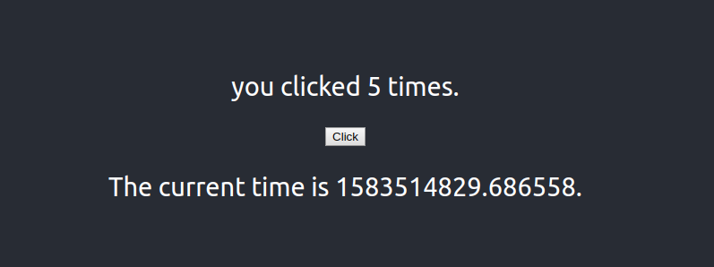

This project was bootstrapped with [Create React App](https://github.com/facebook/create-react-app).

## React with Flask App

This project aim to show how build a simple app using ReactJS and Python Flask with Docker Compose

The time is an API Request, and click button only an event.

### `docker-compose up --build -d `

### `http://localhost:3000`
